[](https://github.com/cenciati/vehicle-insurance-cross-sell/actions/workflows/linter.yml/)

# **Vehicle insurance cross-sell**
<p align="center"></p>
<sub>Author: Gabriel O. Cenciati</sub><br>
<sub>Date: 09-04-2022</sub>

---

# **Table of contents**
  0. Setup
  1. Business problem
  2. Strategy
  3. Insights
  4. Solution
  5. Conclusions
  6. References

---

# **0. 📦 Setup**
## 0.1. 📋 Requirements
* Python >= 3.10
* Pip
* Docker

## 0.2. ⚙️ Running project
**On unix-based systems**

First download the source code with the command:
```bash
$ git clone https://github.com/cenciati/vehicle-insurance-cross-sell.git
```

Now typing the following command `Makefile` will do all the dirty work for you, such as setting up a virtual environment with all dependencies installed and creating the docker container that will initialize the API:
```bash
$ make setup
```

Once you're done, you can clean everything just by typing:
```bash
$ make clean
```

---

# **1. 💼 Business problem**
## 1.1. Introduction
An insurer that provides health insurance to its customers needs help building a model to rank last year's customers in order of propensity to buy new insurance because it does not have enough money to spend convincing each customer separately.

**Problem statement:** Build a model to rank the most likely customers who would be interested in a vehicle insurance.

## 1.2. Target metric
Our interest here is to evaluate how good the ranking made by the model was. That said, a great option is to use a metric that takes into account all relevant customers ranked out of K people previously defined, and that is exactly what a metric called Precision at K (aka Precision@K) does.

<p name="precision-at-k" align="center"></p>

* Where relevant customers are those who will be really interested to buy a vehicle insurace.
* Where K is the number of feasible people to the company get in touch and offer the product.

## 1.3. Assumptions
* People who do not have a driving license but have a vehicle in their name were all considered valid because the column that identifies having or not may cover people who do not have it active at the moment.

---

# **2. 📃 Strategy**
## 2.1. CRISP-DM
CRISP-DM stands for cross-industry process for data mining. The CRISP-DM methodology provides a structured approach to planning a data mining project. It is a robust and well-proven methodology.

This model is an idealised sequence of events. In practice many of the tasks can be performed in a different order and it will often be necessary to backtrack to previous tasks and repeat certain actions. The model does not try to capture all possible routes through the data mining process.
<p align="center"></p>

## 2.2. Steps
### 2.2.1. Project architecture
<p align="center">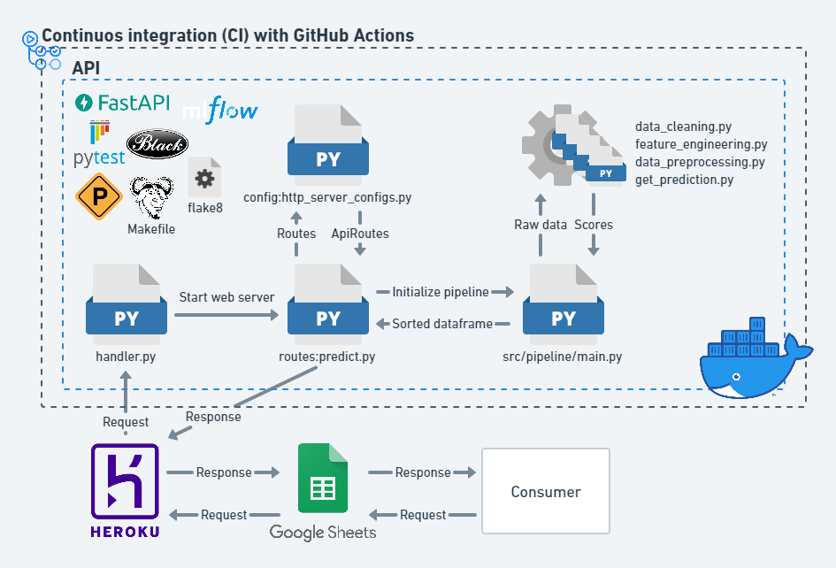</p>

### 2.2.2. Data pipeline
* Business understanding
0. Data acquisition
1. Data cleaning and description
2. Feature engineering
3. Exploratory data analysis
4. Data balancing
5. Data preprocessing
6. Feature selection
7. Machine learning modeling
8. Hyperparameters fine-tuning
9. Calibration
10. Deployment

---

# **3. 🤯 Insights**
## 3.1. Hypotheses
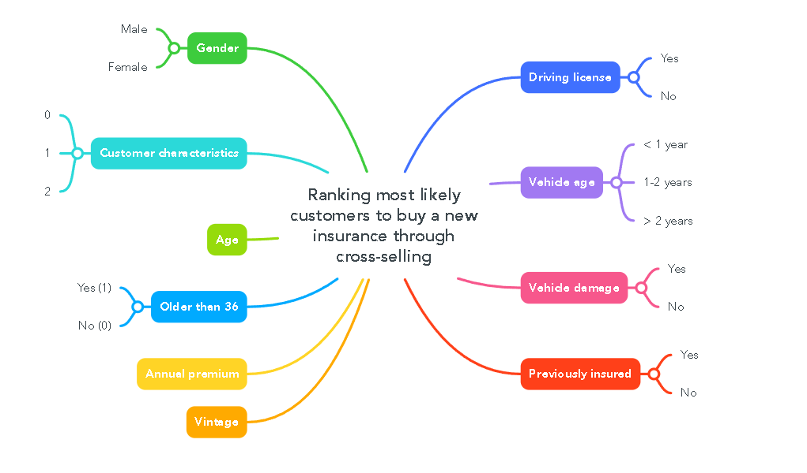
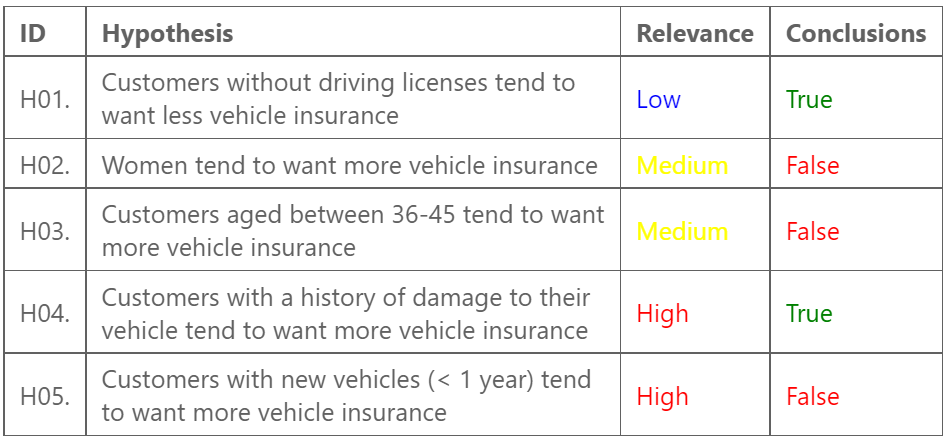

## 3.2. Exploration
<p align="center">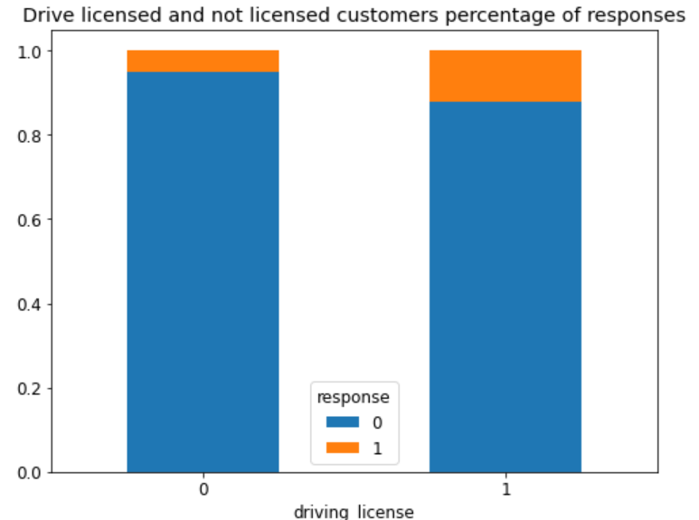</p>

<br>

<p align="center">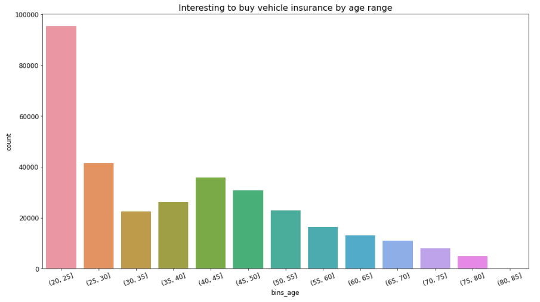</p>

<br>

<p align="center">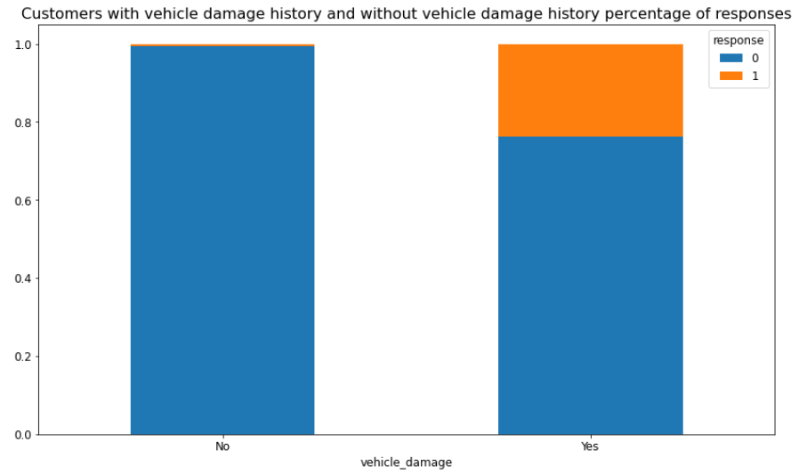</p>

<br>

<p align="center">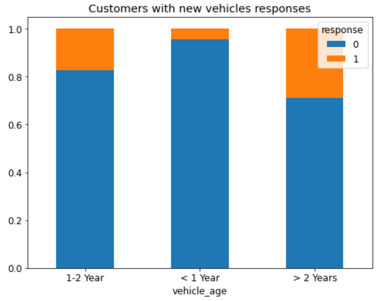</p>

<br>

* In the feature selection step were used two methods to find out the most meaningful columns, wrapper (Boruta) and intrinsic (Random forest's feature importance)
<p align="center">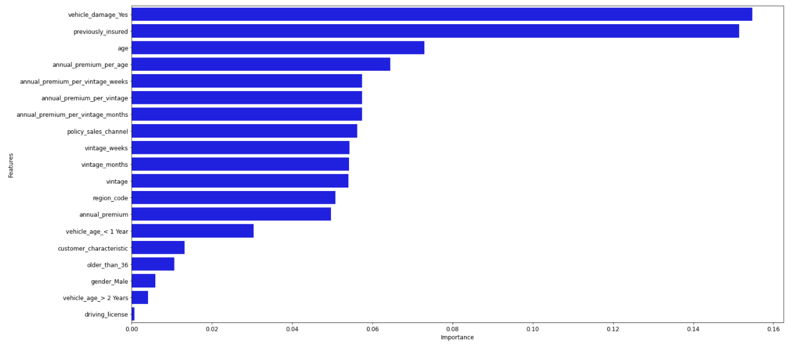</p>

---

# **4. ✅ Solution**
## 4.1. Algorithm applied
The best performance was by a Random Forest Classifier, an ensemble algorithm, which is a set of other less complex algorithms (decision trees in this case). Despite the fact that it has outperformed all other tested algorithms, one of its biggest cons is the computational cost which, depending on the circumstances, can become very expensive to retrain and maintain.

## 4.2. Performance and impact
As reported, it had an excellent performance compared to other algorithms, getting 81.32% of precision at 33.000 records. This means that more than **80% of 33.000 customers out of 70.000 who were considered relevant by the model have a significant chance of buying the new product**.

<br>

1. **Cumulative gains curve**: Indicates the relationship between the percentage of sample (users in the dataset) and the number of interested people that our model is able to classify in that certain sample percentage. In this case, the trained model was able to include 80% of interested customers using only 40% of the dataset.
2. **Lift curve**: Indicates how good is the trained model compared to a random selection of potential customers. In this case, the trained model is more than 2 times better than just a random model.
<p align="center">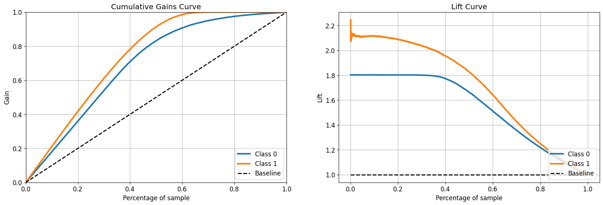</p>

<br>

Many machine learning algorithms are probabilistic, meaning they can calculate a probability of belonging to a certain class. Unfortunately, most of them, like the one used in this project, are not well calibrated. This means that they may be over-confident in some cases and under-confident in other cases.

Therefore, it is often a good idea to calibrate the predicted probabilities for nonlinear machine learning models. However, in this specific case, the calibration had a worse performance in terms of confidence than the not calibrated model.
<p align="center">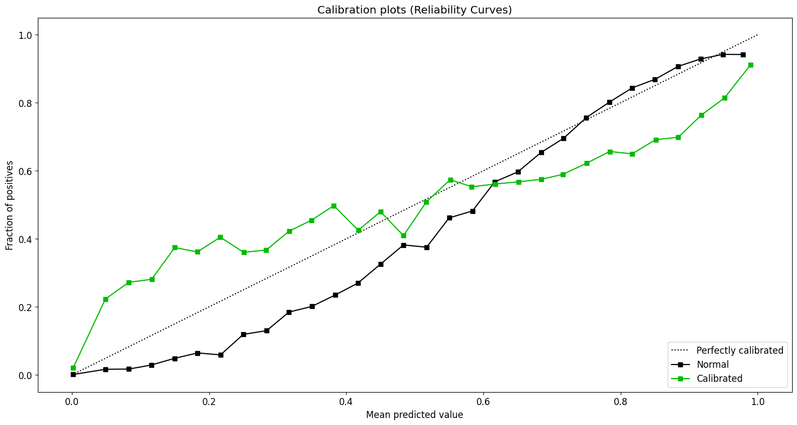</p>

<br>

Both were evaluated using the **Brier score loss**, and as you can see below the calibrated model was a slightly worse. This means that our current model is already well calibrated.
<div align="center">
  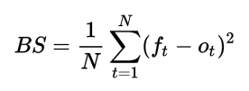
  <p><b>Current model BSL:</b> 9%</p>
  <p><b>Calibrated model BSL:</b> 10%</p>
</div>

---

# **5. 🏁 Conclusions**
## 5.1. Results
* Now the business team can easily predict and rank as many users as they want via an integrated API, just by putting customer information into a ordinary spreadsheet and clicking on the button at the top of the page.
<p align="center">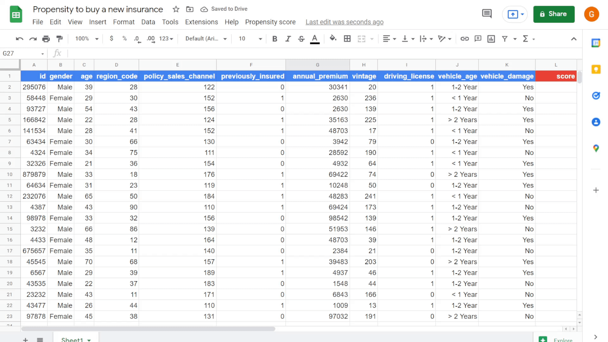</p>

## 5.2. What's next
* Implement some data version control;
* Create more features (e.g., polynomial features);
* Try using target encoder;
* Implement continuous delivery and deployment with GitHub Actions;
* Create a structured retraining and evaluation pipeline using CML.

---

# **6. 📎 References**
[1] [What is the CRISP-DM methodology?](https://www.sv-europe.com/crisp-dm-methodology/)

[2] [MLOps Guide](https://mlops-guide.github.io/)

[3] [Made with ML](https://madewithml.com/)

[4] [Wikipedia - Learning to rank](https://en.wikipedia.org/wiki/Learning_to_rank)

[5] [Recall and Precision at K for Recommender Systems](https://medium.com/@m_n_malaeb/recall-and-precision-at-k-for-recommender-systems-618483226c54)

[6] BROWNLEE, Jason. Data Preparation for Machine Learning: Data Cleaning, Feature Selection, and Data Transforms in Python. 1. ed. 2020.

[7] [Machine Learning Mastery - Probability calibration for imbalanced classification](https://machinelearningmastery.com/probability-calibration-for-imbalanced-classification/)

[8] [Applied ML 2020 - 10 - Calibration, Imbalanced data](https://www.youtube.com/watch?v=w3OPq0V8fr8)